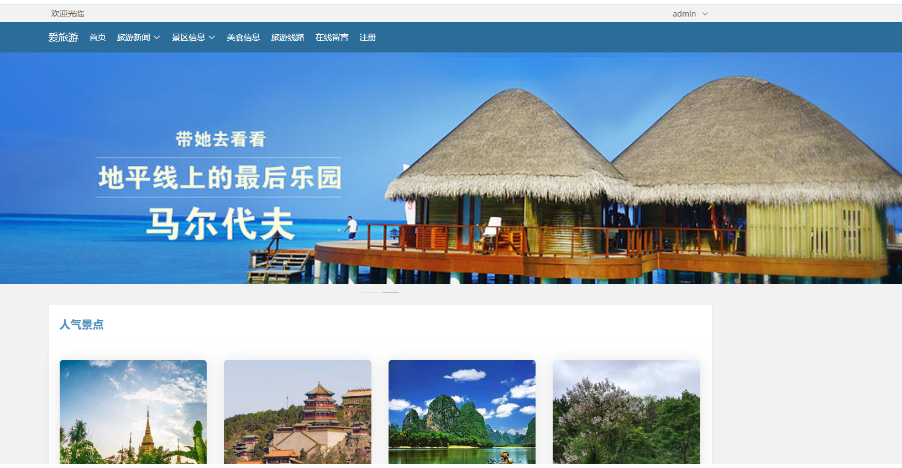
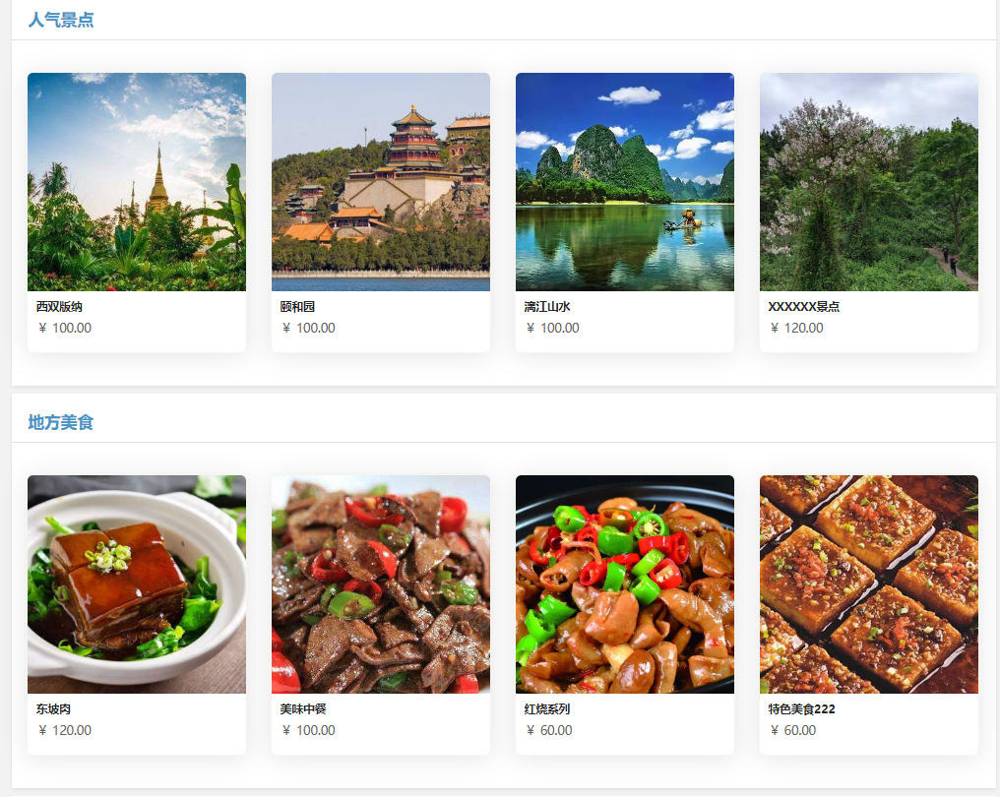
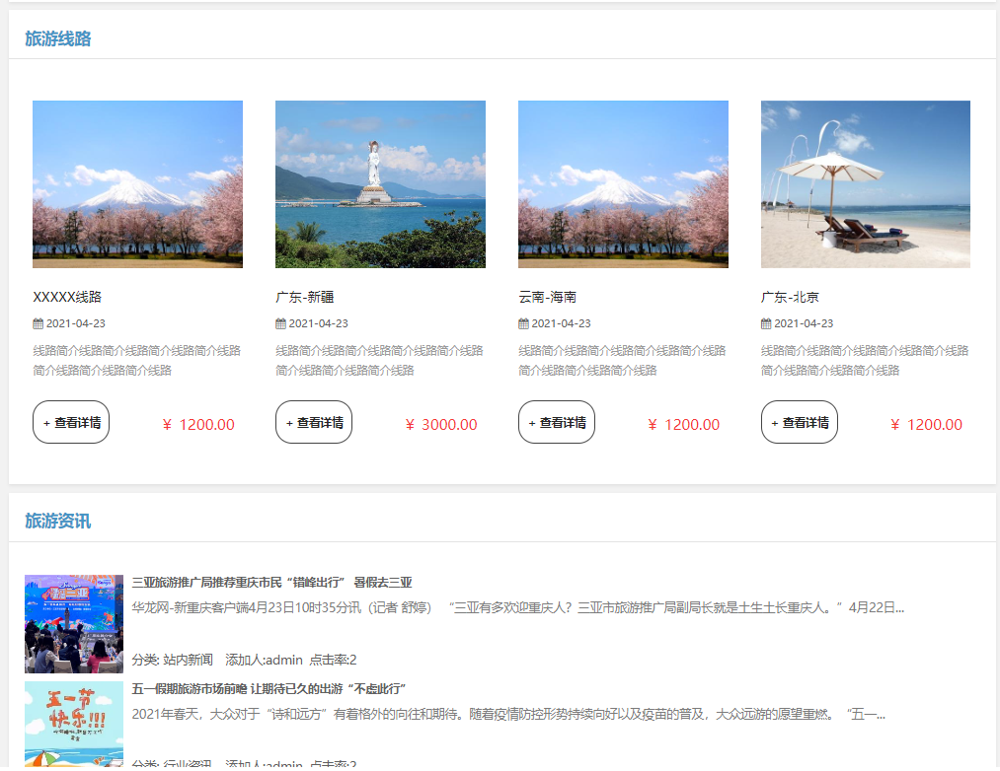
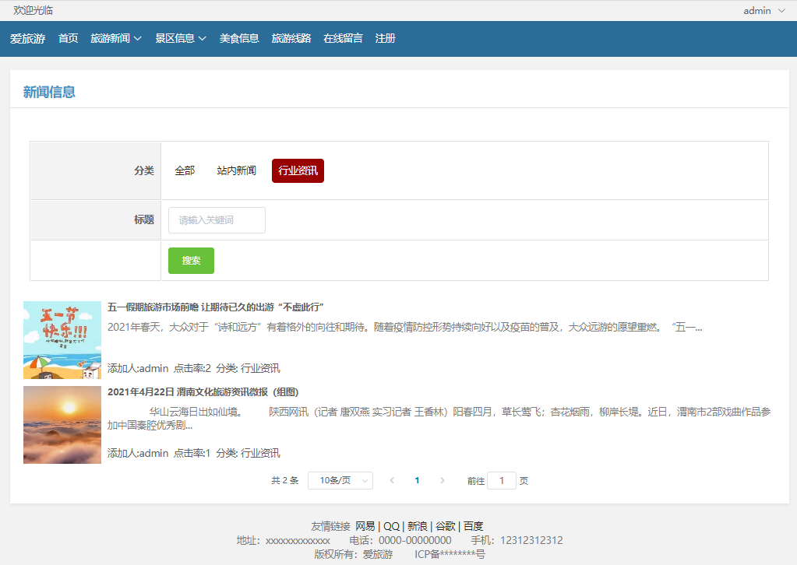
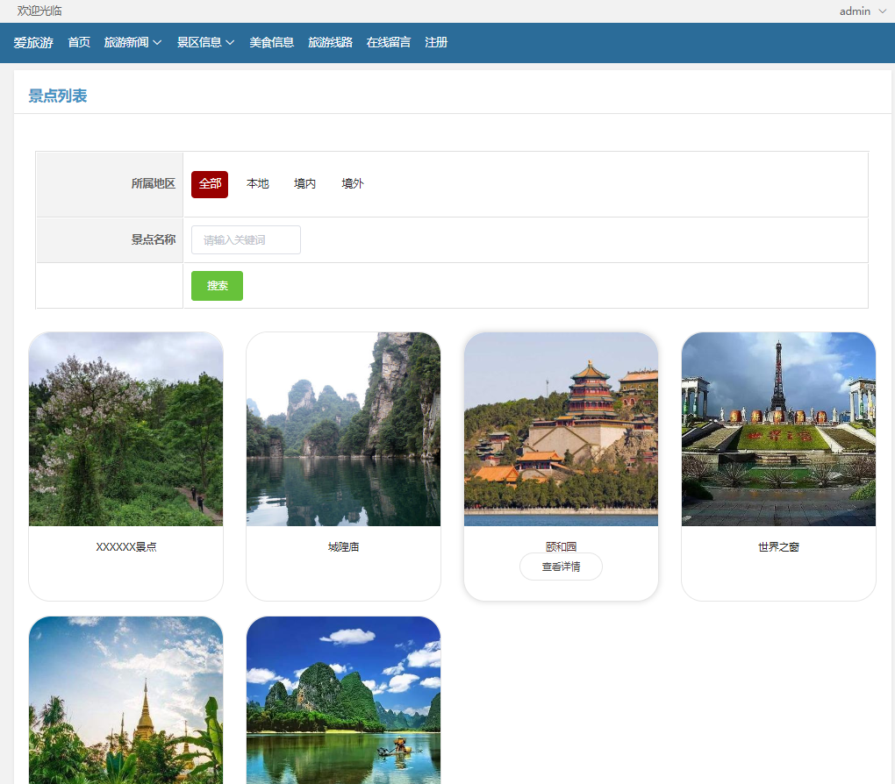
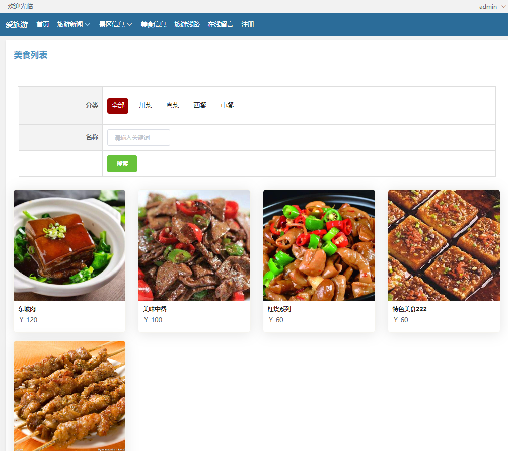
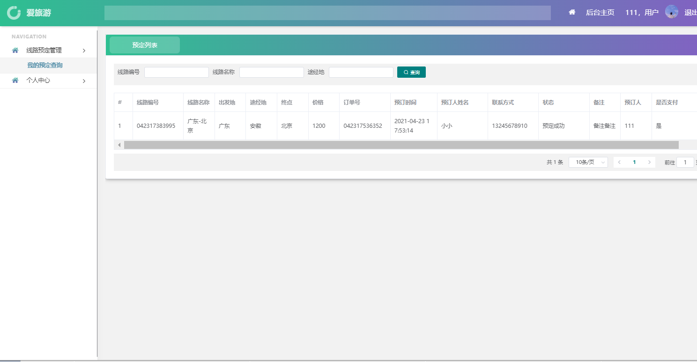
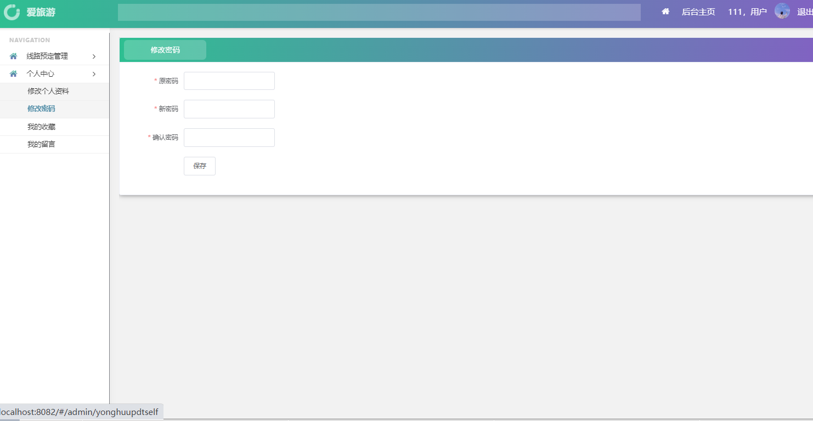
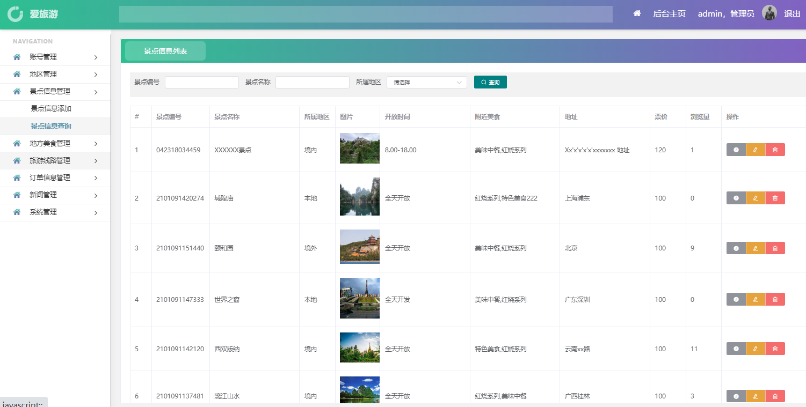
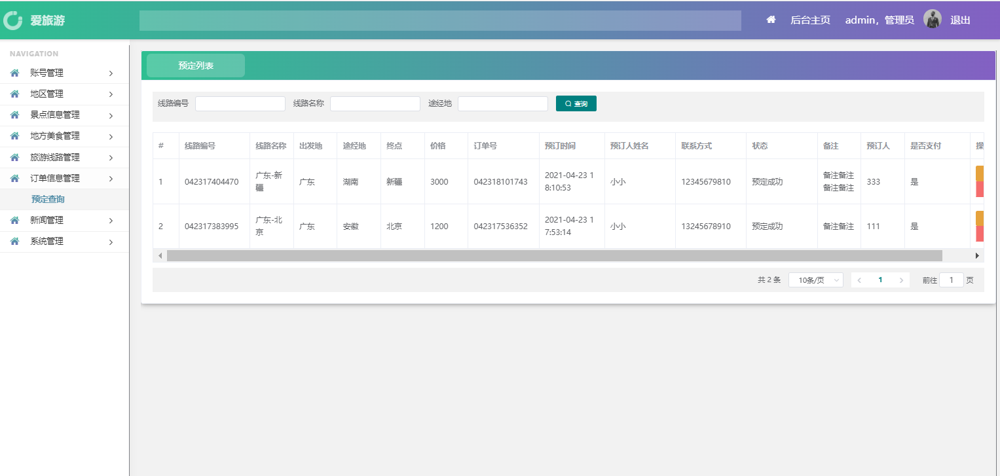

---
### 👉作者QQ ：1556708905 微信：zheng0123Long (支持修改、部署调试、定制毕设)

### 👉接网站建设、小程序、H5、APP、各种系统等

### 👉选题+开题报告+任务书+程序定制+安装调试+ppt 都可以做
---

**毕业设计所有选题地址 [https://github.com/zhengjianzhong0107/allProject](https://github.com/zhengjianzhong0107/allProject)**

**博客地址：[https://blog.csdn.net/2303_76227485/article/details/128651410](https://blog.csdn.net/2303_76227485/article/details/128651410)**

**视频演示：[https://www.bilibili.com/video/BV1fN41167Y2/](https://www.bilibili.com/video/BV1fN41167Y2/)**

## 基于Springboot+vue的景区旅游系统(源代码+数据库)

## 一、系统介绍

本项目分为管理员与普通用户两种角色

- 前台系统包含首页登录、注册、密码修改、首页、旅游新闻、首页轮播、景区信息、美食信息、
  
  旅游线路、留言、个人中心等模块。 
- 后台管理系统包含登录、账号管理、地区管理、景点管理、美食管理、订单管理、旅游线路管理、新闻管理、系统管理模块。

## 二、所用技术

- 后台：Springboot + Mybatis  + Maven +mysql
- 前台：vue + Bootstrap + layui

## 三、环境介绍

基础环境 :IDEA/eclipse, JDK 1.8, Mysql5.7及以上,Node.js,Maven

所有项目以及源代码本人均调试运行无问题 可支持远程调试运行

## 四、页面截图

#### 前台页面

#### 后台管理页面

## 五、浏览地址

前台地址
http://localhost:8082/#/index

普通用户  用户名：111  密码：111

后台地址
http://localhost:8082/#/login

管理员 用户名：admin  密码：admin

## 六、安装教程

1. 使用Navicat或者其它工具，在mysql中创建对应名称的数据库，并执行spbootvue07987lyxxtjxtsjysx-server\database目录下的sql；
2. 使用IDEA/Eclipse导入spbootvue07987lyxxtjxtsjysx-server项目，若为maven项目请选择maven;导入成功后请执行maven clean;maven install命令，然后运行；
3. 修改application.properties里面的数据库配置
4. 启动项目后端项目 
5. vscode打开spbootvue07987lyxxtjxtsjysx-client项目，
6. 打开终端，执行npm install 依赖下载完成后执行 npm run serve,执行成功后会显示访问地址

​     
